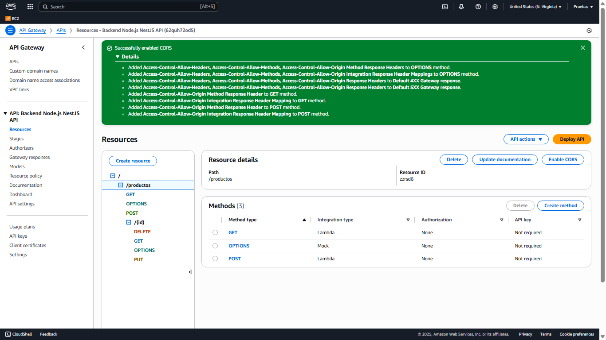
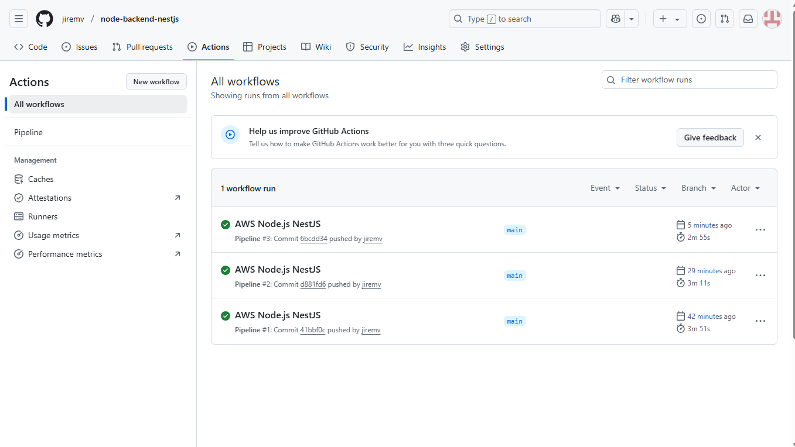

# 🔥  node-backend

Application AWS Node 100% Serverless
https://62quh72od5.execute-api.us-east-1.amazonaws.com/prod/productos

## 📄 Descripción

Este proyecto implementa una solución **serverless**. Esta solución no utiliza servidores EC2, tampoco contenedores Kubernetes. 
Es totalmente administrado por AWS el cual provee elasticidad, escalabilidad y alta disponibilidad.
Este es un proyecto backend java, que puedes utilizar con tus proyectos de frontend.

Utilizamos **Amazon API Gateway** que se comunica muy bien con  **AWS CloudFormation**. 

También tenemos la base de datos 100% serverless **Amazon DynamoDB**. 

---

## 🛠️ Servicios AWS utilizados

- **Amazon API Gateway**
  - Permite controlar CORS .
  - Permite HTTP RESTful.
  - Proporciona el API para cliente frontend.
    

- **AWS CloudFormation**
  - Proporciona IaC.
  - Crea el Stack en los ambientes Dev y Prod.

- **Amazon DynamoDB**
  - Base de Datos 100% serverless.
  - Es no relacional.


- **AWS SAM (Serverless Application Model)**
  - Despliegue de la infraestructura como código (`template.yaml`).

---

## 🚀 Despliegue del proyecto

### 1️⃣ GitHub Actions
- Diríjase al link Actions, allí podrá visualizar el despliegue DevOps.
  

### 2️⃣ Clona el repositorio y navega al proyecto:
```bash
git clone https://github.com/tu-usuario/node-backend-nestjs.git
cd node-backend-nestjs
```

### 3️⃣ Despliegue:
```bash
sam build
sam deploy --guided
```

Durante el despliegue:
- Proporciona el nombre del stack.
- Define la región AWS.
- Acepta permisos de tipo `CAPABILITY_IAM`.

---

## 📈 Beneficios del proyecto

- ✅ Completamente **serverless**.
- ✅ Alta disponibilidad, funciona 24x7x365 sin caídas.
- ✅ Totalmente elástica, si se conectan muchos usuarios, soporta la concurrencia sin límite.
- ✅ Arquitectura automatizada, simple y escalable. Para integrar más recursos y servicios.
- ✅ Costo controlado muy bajo 1$ al mes, sin servidores ni procesamiento batch complejo.

---

## 📘 Documentación de la API

Esta API RESTful está documentada con OpenAPI (Swagger).  
Puedes visualizarla usando herramientas como:
- [Swagger Editor](https://editor.swagger.io/)
- Swagger UI (local o en línea)
- Postman (importando el JSON/YAML)

---

## 📊 Colección para probar con Postman

La colección de pruebas crud es: Quarkus_crud.postman_collection.json

### Archivos incluidos
- `Node_crud.postman_collection.json` – Colección de las pruebas con Postman
- `swagger-productos.json` – Formato OpenAPI 3.0
- `swagger-productos.yaml` – Alternativa legible en YAML

Estodo archivos se encuentran en la carpeta readme


---

## 📋 Consideraciones adicionales

- Este proyecto AWS puede ser montado para su empresa.
- El `template.yaml` crea automáticamente:
  - El cloudformation.
  - La base de datos.
  - El AWS api gateway.

- El proyecto es ideal para ahorrar costos y obtener alta rentabilidad.

---

## 📜 Licencia

Este proyecto es de código abierto. Puedes adaptarlo y reutilizarlo bajo los términos de tu organización.

---

## 🧑 Contacto

**Paul Rivera**
- AWS Certified Solutions Architect - Associate
- Oracle Java EE Master Developer
- Java2 Developer

